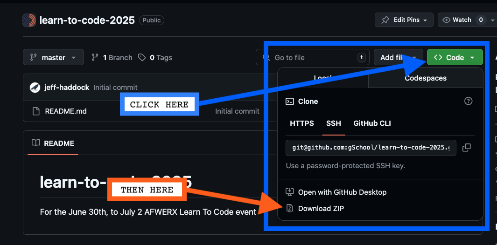

# Welcome to the Learn to Code Event Codebase! 

This repository is for the AFWERX Learn To Code event occurring June 30th to July 2.  This repository will contain all the "starter" code you need to work through the solutions with Jeff and Matt!  

## Beginning Users:

You can download the code from **THIS** very repository!

* Click on the Code button in the repository, 
* Then click "Download ZIP"
* Save it somewhere you will remember (we usually encourage students to make a "/code/" folder).  
* Unzip it, and we'll continue to return to the same code base for the "next sample"

## Advanced Users:

If you are comfortable with git (which we will NOT be covering during this event), please `clone` down this repository.  You will even be able to use it to run in VS Code (or your preferred IDE) if you have a global installation of Node installed.  

## Coding concepts we will cover in this course:

* HTML and JavaScript in a browser's run time environment.  

## Coding concepts this course will NOT cover - that we DO cover in the Galvanize Software Development Immersive (SDI) course:

**Note**: for this event you will NOT need any of the following.

* Setting you your development environment including:
    * VS Code
    * Node environment installations
    * Docker Runtime Environment
    * Creating APIs
* Setup for github, SSH keys, and prepping your account for integration with VS Code 